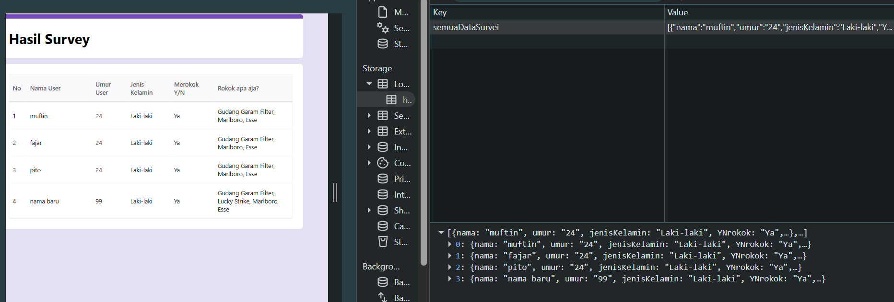

# form Survei Perokok
## di index merupakan form inpum atau kuisioner
## dan di hasilHimpunanSurvei merupakan gambaran Ui hasil dari kuisioner

# menambahkan DOM
## hasil inputan masuk ke dalam local storge dan menampilkan seluruh data di hasilHimpunanSuervei
### deskriptif

## masukan data ke local storge
1. menghubungkan form dgn dom biar bisa di manipulasi
2. ketika form di submit dengen evenLisner dngan tipe submit akan menjalankan proses di dalamnya
3. di paling awal ada event.preventDefault(); yg berguna untuk menghentikan program bawaan google yg kalo form di submit langsung pindang package dan realod browser
4. di dalamnya ada 3 jenis cara mengambil data dari 3 tipe input text, radio, dan checkBox
5. text bisa lansung mengambil isi hasil inputan dengan .value
6. radio mengambil .value yg terdapat checked di dalamnya
7. checkBox ketika di terima belum berbentuk array, jadi harus membuat variabel array kosong dan memasukan nya menggunakan .foreach()
8. seluruh data yg di ambil dari hasil input tadi di jadikan 1 objeck
9. sebelum di masukan cek dulu isi local storge ada isi atau engga kalo ada di parsing dulu baru gunakan sebagai tempat menyimpan seluruh data kalo ga ada bikin variabel array yg baru untuk menampung seluruh data objeck
10. push data objeck baru ke dalam array
11. push data array of objeck ke local storge dan stringfy menjadi tipe json
12. setelah data masuk ke local storge pindah halaman untuk menampilkan data

## menampilkan seluruh isi data dalam local storge
1. bikin data array kosong sebagai penampung data
2. hubungkan penampil data yg ada di html dngn js biar bisa di manipulasi
3. masukan data localstorge ke dalam data penampung
4. data penampung di reasign dngan parsing json biar jadi data array of object
5. di lakukan perulangan untuk menampung data dan di tampilkan di html : nama, umur, jenis kelamin, merokok atau tidak, jenis rokok
6. baru masukan semuanya ke dalam html dari penampil yg sudah di hubungkan sebelumnya dengan appendchill di masukan sebagai anaknya di dalam penampil

